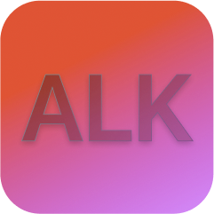

# AlignKit

A Layer 2 framework for NSLayoutConstraint which streamlines constraint Management in UIKit

## Overview




AlignKit is a powerful and intuitive layout framework designed to provide a more manageable and expressive way to handle Auto Layout constraints. It offers a robust yet straightforward API that enables defining, updating, and animating UI constraints with precision, reducing the boilerplate code commonly associated with UIKit's Auto Layout system.

AlignKit goes beyond standard constraint handling by introducing modular, composable functions that allow for highly readable and chainable syntax. Complex layouts can be created with minimal code, thanks to AlignKit’s support for features like conditional constraints, animations, and alignment configurations, which are not typically available in other frameworks like SnapKit. With clear debug output and an organized approach to managing view hierarchies, AlignKit also streamlines troubleshooting and refinement processes during development.

From simple alignment adjustments to sophisticated layout updates, AlignKit provides fine-grained control over both the positioning and behavior of views within apps. Leveraging AlignKit allows for the creation of highly dynamic, adaptive layouts while maintaining clarity in code and functionality, making it an ideal solution for building scalable and maintainable UI in iOS applications.

# Getting Started

Streamlining layout constraints has never been easier. AlignKit allows you to manage your constraints with a clean and intuitive API, while delivering un-compromised performance that matches Apple's native NSLayoutConstraints [See perfomance details](#alignkits-perfomance). 

## Usage

First, import the AlignKit framework into your project:

```swift
import AlignKit
```

### Adding Constraints

Applying constraints with AlignKit is a breeze. Simply select the UIElement you want to constrain, and use the `alk.makeConstraints` method to define your layout:

```swift
button.alk.makeConstraints { frame in
    frame.center.equalToSuperview()
    frame.size.equalTo(200)
}
```

Adding relative constraints have just got easier, use the same `equalTo` modifier:

```swift
button.alk.makeConstraints { frame in
    frame.size.equalTo(90)
    frame.trailing.equalToSuperview()
    frame.bottom.equalTo(buttonOne.anchor.top).inset(16)
}
```

### Updating and Removing Constraints

Updating existing constraints is equally straightforward with `alk.updateConstraints`:

```swift
button.alk.updateConstraints { frame in
    frame.width.height.equalTo(200)
}
```

If you need to remove a particular constraints, use the `alk.removeConstraints` method:

```swift
button.alk.removeConstraints { frame in
    frame.width.equalTo(200)
}
```

To remove all constraints related to a view, you can use the same method as described above, but without involving a closure.

```swift
button.alk.removeConstraints()
```

> [!Warning]
> Updating or Removing a constraint which is not added to element will cause assertionFailure

📌 This document is a guide that explains how to use AlignKit. You can also check the AlignKit's [API documentation](https://alignkit-gokulnairs-projects.vercel.app/documentation/alignkit).

## Constraint Modifiers
These are various kinds of modifiers available in AlignKit to chain on, among them some types are

### Relational Modifiers
These modifiers are used to create relation among views.

| API | Description |
|-----|-------------|
| `equalToSuperView()` | Specifies that the constraint should be equal to the superview's corresponding attribute. |
| `equalTo(constant: ConstraintConstantValue)` | Specifies that the constraint should be equal to a constant value or relative anchor. |
| `lessThanOrEqualToSuperView()` | Specifies that the constraint should be less than or equal to the superview's corresponding attribute. |
| `lessThanOrEqualTo(constant: ConstraintConstantValue)` | Specifies that the constraint should be less than or equal to either given relative anchors or constant value. |
| `greaterThanOrEqualToSuperView()` | Specifies that the constraint should be greater than or equal to the superview's corresponding attribute. |
| `greaterThanOrEqualTo(constant: ConstraintConstantValue)` | Specifies that the constraint should be greater than or equal to either given relative anchors or constant value. |

### Layout Modifiers
These modifiers are used to enhance the layouting of each elemenent

| API | Description |
| -- | -- |
| `inset(_ constant: CGFloat)` | Sets an inset value for the constraint |
| `offset(_ constant: CGFloat)` | Sets an offset value for the constraint, applying a negative constant |
| `multiplier(_ constant: CGFloat)` | Sets a multiplier for the constraint |
| `divider(_ constant: CGFloat)` | Sets a divider for the constraint by applying the reciprocal of the constant |
| `priority(_ value: ConstraintPriorityValue)` | Sets the priority of the constraint using a `ConstraintPriorityValue` |
| `priority(_ value: ConstraintPriorityType)` | Sets the priority of the constraint using a `ConstraintPriorityType` |
| `labeled(_ label: String)` | Sets a label for the constraint, allowing for easier identification in debugging or logging |

Go through the [documentation](https://alignkit-gokulnairs-projects.vercel.app/documentation/alignkit) to have a better understanding.

### Utility Methods

AlignKit also provides handy utility methods to assist with debugging and optimization:

| API | Description |
| -- | -- |
| `debugPrintIf(_:_:)` | Debug prints the constraints in readble format along with the prefix, for a desired condtion |
| `debugPrintWith(_:)` | Debug prints the constraints in readble format along with the prefix |
| `animateWith(_:)` | Animate constraint changes with the provided time interval |
| `applyIf(_:)` | Apply constraints on if the provided condition succeeds |

With AlignKit, you get the power of NSLayoutConstraints combined with a modern, developer-friendly API. 
You can use these modifiers instantly after chaining the [alk](Sources/AlignKit/Extensions/View+Extension.swift) DSL.

> [!Note]
> AlignKit have an auto constraint sanitiser which sanitises constraints applied on any view by removing redundant constraints provided.

## AlignKit's principles and philosophy

* AlignKit layouting is simple, powerful and fast.
* AlignKit intention is to optimise the technique of using NSLayoutConstraints. 
* AlignKit syntax is concise and chainable.
* AlignKit is incredibly fast, it's as faster as NSLayoutConstraints. [See Performance](#alignkits-perfomance).
* The source code for chaining syntaxes are very much similar to SnpKit
  
NOTE: Being very familiar with SnapKit, we have kept AlignKit syntanxes to be as similar as SnapKit(Along with some improved syntaxes). 

## AlignKit's Perfomance 

Through performance testing, we have found that AlignKit not only matches but, in certain scenarios, surpasses the impressive performance of NSLayoutConstraints. Additionally, it offers a significantly more modern and intuitive API for developers to work with. Our analysis also reveals that AlignKit outperforms the leading market alternative, SnapKit, in various aspects. Check out the detailed [performance testing](Perfomance_Test_Report.md) report to learn more about how AlignKit stands out.

Enjoy the benefits of a clean, streamlined approach to managing your layout constraints, without compromising on the performance. AlignKit truly offers the best of both worlds, empowering you to build fast, efficient, and visually stunning iOS apps.

| FPS | CPU |
| -- | -- |
| |  | 

The following simulation was done on iPhone 14, running on iOS 18.1 with a testing procedure of same parameters

## Installation

AlignKit is available via Swift Package Manager. 

To integrate AlignKit into a Xcode target, use the ```File -> Swift Packages -> Add Package Dependency``` menu item.

To integrate AlignKit into another Swift Package, add it as a dependency:

```swift
.package(url: "https://github.com/gokulnair2001/AlignKit", branch: "main")
```

# License

AlignKit is available under MIT License

Copyright (c) 2024 Gokul Nair

Permission is hereby granted, free of charge, to any person obtaining a copy
of this software and associated documentation files (the "Software"), to deal
in the Software without restriction, including without limitation the rights
to use, copy, modify, merge, publish, distribute, sublicense, and/or sell
copies of the Software, and to permit persons to whom the Software is
furnished to do so, subject to the following conditions:

The above copyright notice and this permission notice shall be included in all
copies or substantial portions of the Software.

THE SOFTWARE IS PROVIDED "AS IS", WITHOUT WARRANTY OF ANY KIND, EXPRESS OR
IMPLIED, INCLUDING BUT NOT LIMITED TO THE WARRANTIES OF MERCHANTABILITY,
FITNESS FOR A PARTICULAR PURPOSE AND NONINFRINGEMENT. IN NO EVENT SHALL THE
AUTHORS OR COPYRIGHT HOLDERS BE LIABLE FOR ANY CLAIM, DAMAGES OR OTHER
LIABILITY, WHETHER IN AN ACTION OF CONTRACT, TORT OR OTHERWISE, ARISING FROM,
OUT OF OR IN CONNECTION WITH THE SOFTWARE OR THE USE OR OTHER DEALINGS IN THE
SOFTWARE.

